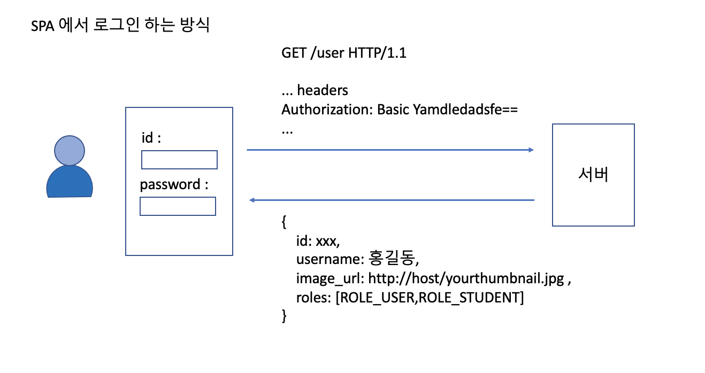

# BasicAuthenticationFilter

- 기본적으로 로그인 페이지를 할 수 없는 상황에서 사용
  - SPA 페이지 (react, angular, vue ...)
  - 브라우저 기반의 모바일 앱

- 설정 방법

```java
public class SecurityConfig extends WebSecurityConfigurerAdapter {
    @Override
    protected void configure(HttpSecurity http) throws Exception {
        http
            .httpBasic()
            ;
    }
}

```

- SecurityContext 에 인증된 토큰이 없다면 아래와 같은 포맷의 토큰을 받아서 인증처리를 하고 간다.


- http에서는 header에 username,password값이 묻어가기 때문에 보안에 매우 취약하다. 그러므로 반드시 https 프로토콜을 사용할것을 권장한다.
- 최초 로그인 시에만 인증을 처리하고, 이후에는 session에 의존한다. 또 rememberMe 를 설정한경우, 리멤버미 쿠키가 브라우저에 저장되기때문에, 세션이 만료된 이후라도 브라우저 기반의 앱에서는 장시간 서비스를 로그인 페이지를 거치지 않고 이용할 수 있다.
- 에러가 나면 401(UnAuthorized) 에러를 내려보낸다.

#### 로그인 페이지처리는 주로 아래와 같은 방식으로 한다.



# SecurityContextPersistenceFilter

- Security

# Bearer 토큰